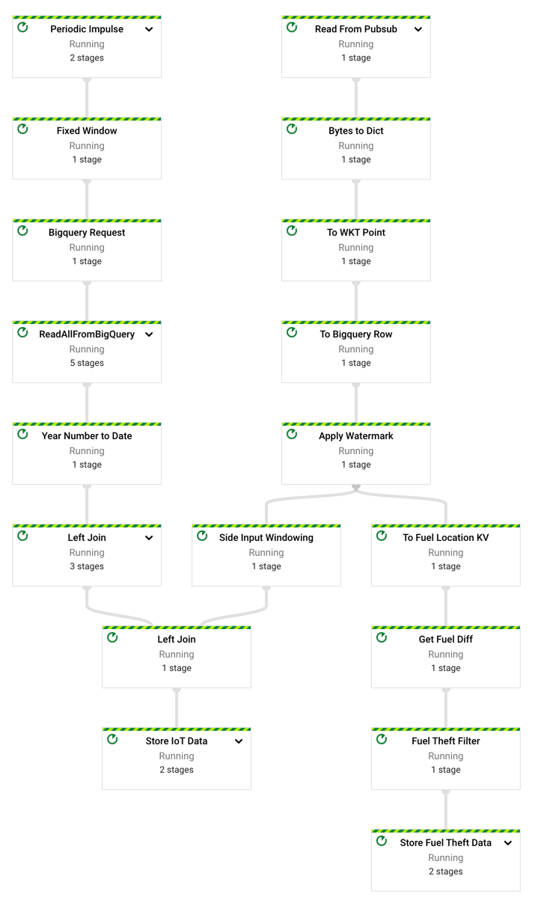
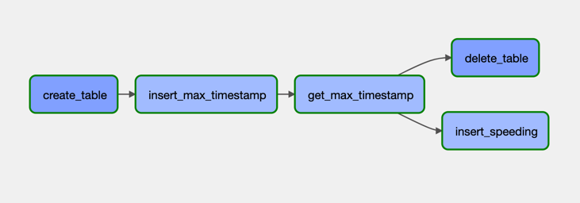

# Fahmi Google Cloud Data Engineering Portfolio

## Overview
In this project I built data pipeline to analyze stream of data coming from heavy equipment's IoT.
This project analyze the activity of equipment to alert fuel robbery and speeding.
Tech stacks I used in this project are:
- Google Cloud Pubsub - to stream incoming data from IoT
- Google Cloud Dataflow - streaming analytic and store data to BigQuery
- BigQuery - sink and data warehouse
- Google Cloud Build - continuous delivery pipeline
- Apache Airflow - orchestrator
- Docker - postgres hosting
- Google Cloud Compute Engine - To host Airflow and Postgresql

## Modules

### Mock GPS Publisher
Since it's impossible for me to buy millions dollar worth of heavy equipment for this project,
so I decided to built mock. This mock will send mock data to Google Cloud PubSub with specified topic.
Example of the payload of this mock:
```json
{
    "timestamp": 1643119127,
    "id": 1,
    "x": 107.304833431421,
    "y": -6.39885509331658,
    "fuel_level": 89.2
}
```

### Dataflow
There are three thing that Dataflow do in this project:
1. Transform and enrich with left join by using side input
2. Detect fuel theft by using stateful `DoFn`
3. Sink data to BigQuery

The code in [iot-pipeline.py](src/dataflow/iot-pipeline.py) will do all the three things I mentioned.
And the result the code is this pipeline in Dataflow:


To deploy this pipeline automatically, I used Google Cloud Build.
You can see the code here [dataflow.cloudbuild.yaml](cd-pipeline/dataflow.cloudbuild.yaml)

### Airflow
Airflow in this project only has one DAG, to calculate heavy equipment speeding.
the code in [speeding.py](src/airflow/speeding.py) will produce this pipeline

